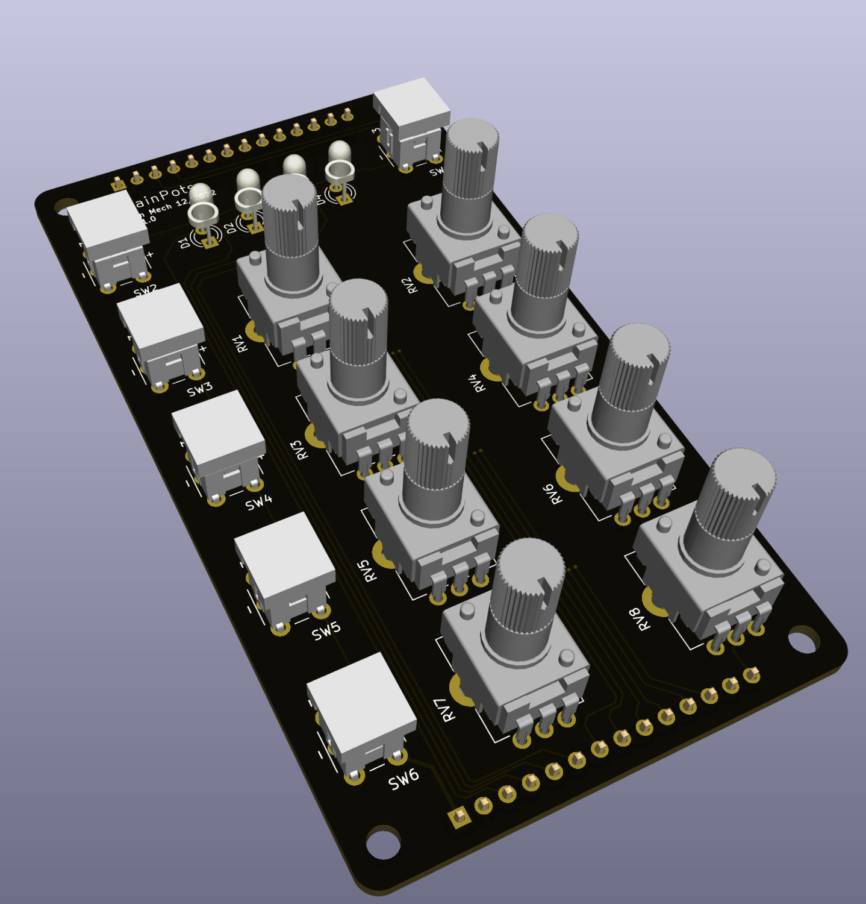

# RainPots Project
A modular physical controller system for Max/RNBO Patches running on a Raspberry Pi

**¡This Project is still under creation. More files and documentation will be added eventually!**

